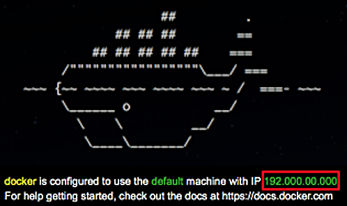
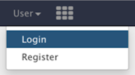
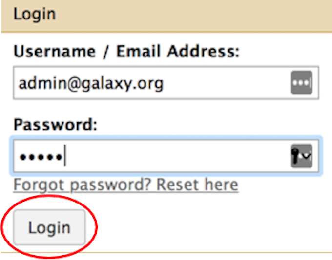

---
search:
  exclude: true
---

# Installation

!!! warning
    This documentation is for AMR++ version 1.1. Click [here](../../latest/gettingstarted.md) for the latest docs.

The following installation will take approximately 30 minutes.

## Software Requirements

To install Docker, you will need access to one of the following operating systems:

- Mac OS X (10.8 or above)
- Linux 64-bit

---

## Docker

??? example "Install via Docker"

    **Why Install via Docker?**
    
    - Docker packages an entire piece of software into its own filesystem.
    - Docker rids users of dependency nightmares caused by complex software.
    
    ###Step 1
    ####Download Docker
    Mac Users: Follow the instructions [here](https://docs.docker.com/v1.11/engine/installation/mac/#installation).
    Linux Users: Follow the instructions [here](https://docs.docker.com/v1.11/engine/installation/linux/).
    
    !!! Note
        You must have sudo privileges to install Docker via Linux.

    ---
    
    ###Step 2
    ####Start Docker with a Mac

    Open your Launchpad, and click on the DockerQuickStart icon. This will open a terminal and start Docker using a default virtual machine. Be sure to take note of the IP address (highlighted in red) Docker was started on.

    **The IP address will be different than the one highlighted below.**

    { loading=lazy }

    To launch your Galaxy instance, type this exact command into the terminal (omitting the '$' sign):

    ```
    $ docker run -d -p 8080:80 -p 8021:21 chrisd/amrplusplus
    ```
    
    ####Start Docker with Linux
    
    Open a terminal, and type these exact commands (omitting the '$' sign):

    ```
    $ sudo service docker start
    $ sudo docker run -d -p 8080:80 -p 8021:21 chrisd/amrplusplus
    ```
    
    !!! Note
        When running these commands for the first time, Docker will go out and look for the chrisd/amrplusplus repository and download the latest AmrPlusPlus Docker image. When the install completes, you should see a message similar to the one below.

        ```
        $ Digest: sha256:7e992b68ddb9a2e37a9f2b862de015445912d20cc98d13970603939330b0433e
        $ Status: Downloaded newer image for chrisd/amrplusplus:latest
        $ 10ab4d35cf798a2e46a0ec4e2eaf15377c3558772b3f5d0e1107025a9b922f76
        ```
        
        If you see this message, that means the latest version of the pipeline was downloaded successfully and is currently running on your machine.

    ---
    
    ###Step 3
    ####Connecting to the Server on a Mac
    
    Open a web browser, and navigate to:

    ```
    http://default-ip:8080
    ```
 
    !!! Warning
        Replace deafult-ip with the IP address Docker was started on. For example, if the IP address was 192.000.00.000, then you would enter http://192.000.00.000:8080 into your web browser. If you forgot the IP address, you can find it by scrolling to the top of your terminal.

    ---

    ####Connecting to the Server on Linux
    
    Open a web browser, and navigate to:

    ```
    localhost:8080
    ```
    
    Once connected, you should see a page similar to the following:

    


    ###Step 4
    ####Log in to Server
    
    Next, we need to login. From the navigation bar at the top of the Galaxy homepage, click on the **User** tab and goto **Login**.

    
    
    In the Username field, enter **admin@galaxy.org** and in the Password field, enter **admin** and click on the Login button.

    

    ---
    
    ###Step 5
    ####Import Workflow
    
    Next, we need to [Import the Workflow](import.md).

## Galaxy

??? example "Install via Galaxy"

    ###Before You Begin

    If you installed Galaxy via Docker, you do not need to read this section. Galaxy comes installed when you run Docker. See the [Import Workflow](import.md) for next steps.

    This section is only for those who have a production Galaxy server and wish to download the AmrPlusPlus pipeline via the Galaxy Main Toolshed.

    ---

    ###Software Requirements
    
    - Production Galaxy Server
    - Admin account
    - GNU Make and GCC compiler

    ###Tool Installation
    
    1. Log in to your Galaxy server with your admin account.
    1. Find the admin tab in the navigation bar -> Search Tool Shed -> Galaxy Main Toolshed ->Browse Valid Repositories -> Metagenomics -> suite_amrplusplus -> Preview and Install.
    1. Click on the Install button at the top of the page.
    1. Make sure the Handle Repository Dependencies and Handle Tool Dependencies boxes are checked.
    1. In the Add New Tool Section Panel, enter AmrPlusPlus into the text box.
    1. Click on the Install button at the bottom of the page.

*[sudo privileges]: sudo is a program for Unix-like computer operating systems that allows users to run programs with the security privileges of another user, by default the superuser.
*[GNU Make]: GNU Make is a tool which controls the generation of executables and other non-source files of a program from the program's source files.
*[GCC compiler]: The GNU Compiler Collection (GCC) is a compiler system produced by the GNU Project supporting various programming languages. GCC is a key component of the GNU toolchain. 