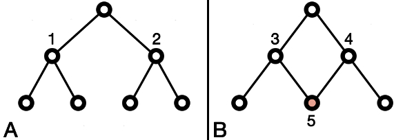

# 

The MEGARes V3.0 database contains sequence data for nearly 9,000 hand-curated resistance genes for antimicrobial drugs, biocides and metals, with an annotation structure that is optimized for use with high throughput sequencing. The acyclical annotation graph of MEGARes allows for accurate, count-based, hierarchical statistical analysis of resistance at the population level, much like microbiome analysis, and is also designed to be used as a training database for the creation of statistical classifiers (Figure 1).

<figure markdown>
  { width="450" }
  <figcaption>
    <strong>Figure 1</strong>
    
A.) This annotation graph contains no cycles (is a tree), as nodes 1 and 2 do not share children
      and are therefore independent. 
      B.) In contrast, node 3 and node 4 share node 5 as a child, which creates a cycle in the annotation graph.
      

  </figcaption>
</figure>

## When should I use MEGARes?

For the population-level profiling or population comparison of antimicrobial resistance (count-based analyses, similar to microbiome analysis). MEGARes can also be used for the construction of sequence classifiers, e.g. naive Bayes, hidden Markov models. For users who wish to predict the protein function and functional mutations in their sequencing data, we recommend using a database suited for functional genomics, such as the Comprehensive Antibiotic Resistance Database (CARD).

## What distinguishes MEGARes from other databases?

MEGARes has been designed for use in the computational analysis of large-scale sequencing data (on the order of terabytes) 
in a way that is fast and accurate for statistical analyses on count-based data and the construction of sequence classifiers. 
MEGARes incorporates previously published resistance gene sequences for antimicrobial drugs, biocides, and metals. 

- Sequences are annotated in a biologically meaningful way that preserves within-group nucleotide similarity.
- The annotation graph contains no cycles.  Therefore, it contains no statistical dependencies and is accurate for the count-based analyses commonly performed in population-level profiling (Figure 1).
- The annotation graph contains only three hierarchical levels, which maximizes the number of representative sequences for each annotation node.  This is designed to work well for the construction of statistical classifiers.  The annotation levels are:
    - Type: the type of antimicrobial compound, e.g. drugs, biocides, multi-compound
    - Class: the major antimicrobial chemical class, e.g. betalactams, aminoglycosides
    - Mechanism: the biological mechanism of resistance, e.g. penicillin binding protein
    - Group: the gene- or operon-level group for that sequence, e.g. SHV betalactamase, MCR-1
    - All sequence metadata has been formatted to work well with the majority of bioinformatics software.  Sequence headers contain no whitespace or non-compliant symbols.
    - All sequences and annotations have been hand-curated using a multi-factorial approach.  See the manuscript for more details.

## Citation for MEGARes V3.0 and AMR++ V3.0:

Pending: Watch for the announcement to be published in the _Nucleic Acid Research_ Database Issue, January, 2023.

## Citation for MEGARes V2.0 and AMR++ V2.0:

Doster, E., Lakin, S. M., Dean, C. J., Wolfe, C., Young, J. G., Boucher, C., Belk K. E., Noyes N. R., Morley P. S. (2019)

MEGARes 2.0: a database for classification of antimicrobial drug, biocide and metal resistance determinants in metagenomic sequence data. Nucleic Acids Res. doi:10.1093/nar/gkz1010.

[Click to Download Citation in different formats](https://academic.oup.com/nar/advance-article/doi/10.1093/nar/gkz1010/5624973)

## Citation for MEGARes V1.0 and AmrPlusPlus V1.0:

Lakin, S.M., Dean, C., Noyes, N.R., Dettenwanger, A., Spencer Ross, A., Doster, E., Rovira, P., Abdo, Z., Jones, K.L., Ruiz, J., Belk, K.E., Morley, P.S., Boucher, C. (2016)

MEGARes: an antimicrobial database for high throughput sequencing. Nucleic Acids Res., 45. DOI: 10.1093/nar/gkw1009

[Click to Download Citation](http://nar.oxfordjournals.org/citmgr?gca=nar%3Bgkw1009v1)
